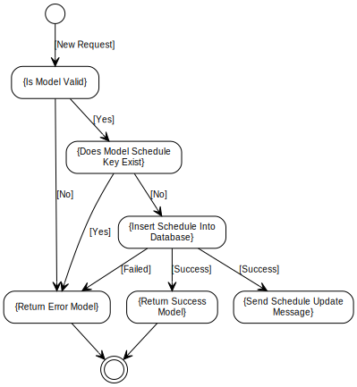
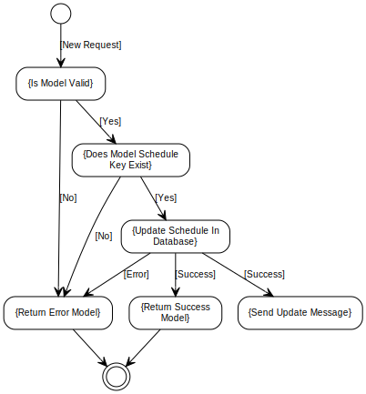

[Home](../index.md) -> [Schedule](index.md)

# Extra Validation Rules
DefaultMinValue and DefaultMaxValue must differ by at least MinimumDifference.

# Get Schedule Flow

# Get Paged Schedule Flow

# Add Schedule Flow

# Update Schedule Flow

# Delete Schedule Flow
