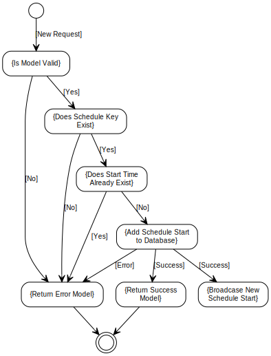
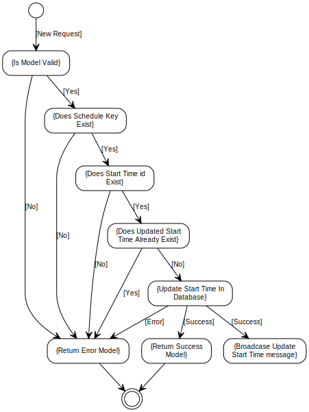
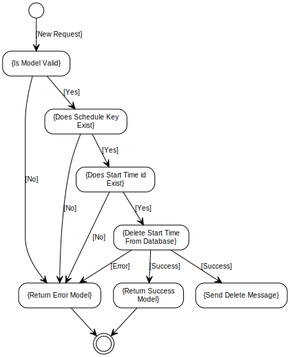

[Home](../index.md) -> [Schedule](index.md)

# Extra Validation Rules
ValueMin and ValueMax must differ by at least MinimumDifference.

# Add Schedule Start Flow

# Update Schedule Start Flow

# Delete Schedule Start Flow
