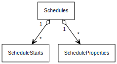

## Schedule Table Schema

 
 

__Schedules__

|Column|Type|Key|Nullable|
|--|--|--|--|
|ScheduleId|long|Primary Key|false|
|LocalDeviceId|Guid|Foreign Key(Devices)|false|
|ScheduleKey|Guid|Index|false|
|DefaultMinValue|double||false|
|DefaultMaxValue|double||true|
|MinimumDifference|double||true|

Note: DefaultMinValue is always required but DefaultMaxValue does not have to be set but is used for schedules like temperature. So you can say if its less then 70 degrees turn the heater on if the more then 80 degrees turn on the ac. But if this schedule was for sprinklers we would not need the DefaultMaxValue instead we would use DefaultMinValue as a flag value to say which zone should be turned on though it would probably be 0 here. MinimumDifference is so you can say DefaultMinValue and DefaultMaxValue must be separated by at least MinimumDifference in everything pertaining to this schedule.

 

__Devices__

|Column|Type|Key|Nullable|
|--|--|--|--|
|LocalDeviceId|Guid|Primary Key|false|
|DeviceId|int|Virtual Foreign Key(Devices Service)|false|
|Uuid|Guid|Index(Uuid)|true|
|MacAddress|long|Index(MacAddress)|true|
|Manufacture|string|Index(Manufacture, ManufactureId)|true|
|ManufactureId|string|Index(Manufacture, ManufactureId)|true|

 

__ScheduleProperties__

|Column|Type|Key|Nullable|
|--|--|--|--|
|SchedulePropertyId|Guid|Primary key|false|
|ScheduleId|long|Foreign Key(Schedules)|false|
|Name|string(512)|Index|false|
|Value|string(1024)||true|

 

__ScheduleStarts__

|Column|Type|Key|Nullable|
|--|--|--|--|
|ScheduleStartId|Guid|Primary Key|false|
|ScheduleId|long|Foreign Key(Schedules)|false|
|Name|string(255)||false|
|Start|DateTimeOffset||false|
|Type|Enum(DayOfWeek,Interval,Date,Length)||false|
|Duration|int||true|
|ValueMin|double||false|
|ValueMax|double||true|